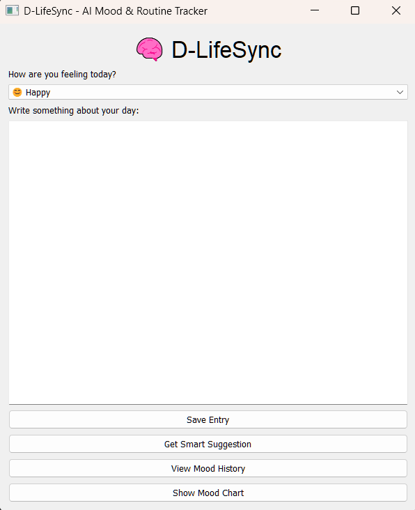
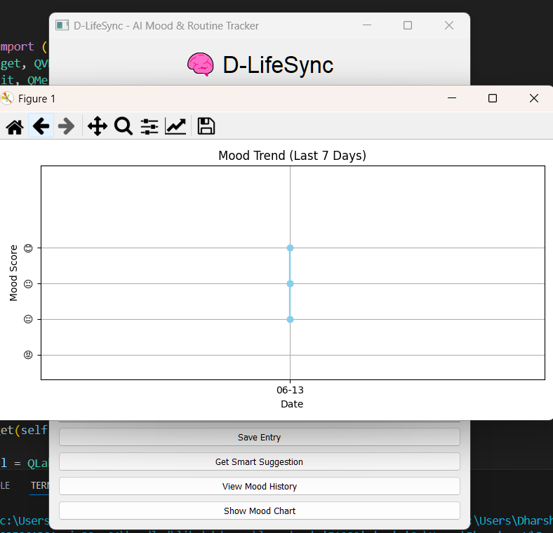
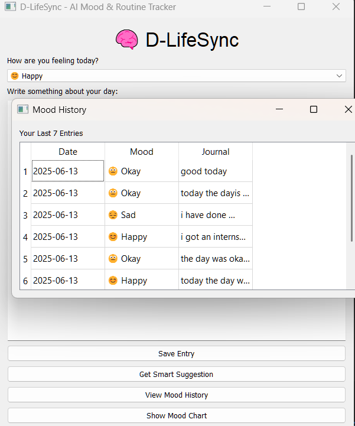
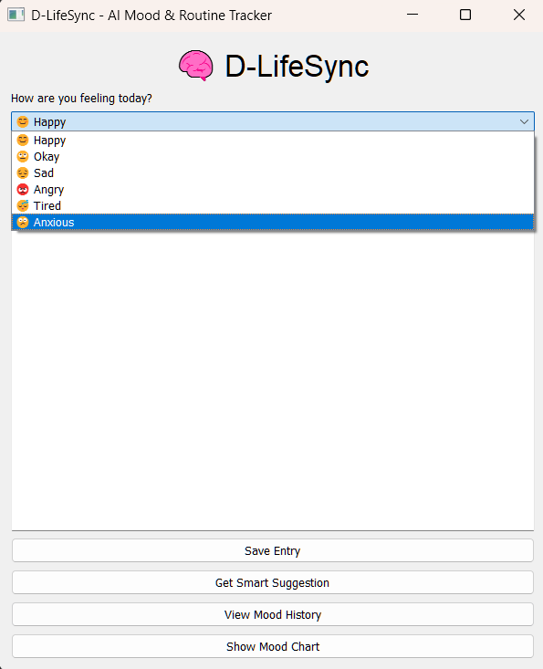
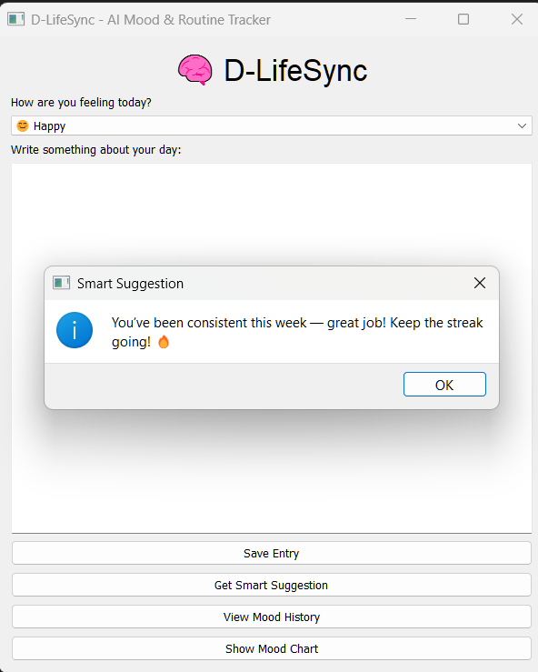

# 🧠 LifeSync – AI Mood & Routine Tracker (PyQt5)


> LifeSync is a desktop-based AI-powered mood and routine tracker built using PyQt5.  
It helps you log your daily feelings, reflect through journaling, and get smart wellness suggestions — all stored securely offline.

---

## 🚀 Features

- 🎭 Emoji-based **Mood Tracker**
- 📓 Daily **Journal Logging**
- 🤖 **AI Suggestions** based on your mood
- 📊 **Mood Trend Charts** (last 7 days)
- 📅 **Log Viewer** for past entries
- 💾 Stores data **locally using SQLite**
- 🧠 Clean, intuitive PyQt5 interface

---
## 🖼️ Screenshots

| Main UI | Mood Chart | History Log |
|---------|------------|--------------|
|  |  |  |  |  |


## 🛠️ Installation & Run

### 🔧 Requirements
```bash
pip install pyqt5 matplotlib
```

### ▶️ Run the App
```bash
python lifesync_ai_mood_tracker.py
```

> The app will create a `lifesync.db` SQLite file in the same folder automatically on first run.

---

## 📁 Where is the Data Stored?

All mood logs and journal entries are saved in a local SQLite file:

```
lifesync.db
```

No internet or cloud storage — your thoughts stay secure and private on your machine.

---

## 👤 Author

Made with ❤️ by **Dharshan V**  
🔗 [Connect with me on LinkedIn](https://www.linkedin.com/in/dharshanvreddy/)

---

## 📜 LICENSE (MIT)

```text
MIT License

Copyright (c) 2025 <DHARSHAN>

Permission is hereby granted, free of charge, to any person obtaining a copy
of this software and associated documentation files (the “Software”), to deal
in the Software without restriction, including without limitation the rights
to use, copy, modify, merge, publish, distribute, sublicense, and/or sell
copies of the Software, and to permit persons to whom the Software is
furnished to do so, subject to the following conditions:

The above copyright notice and this permission notice shall be included in
all copies or substantial portions of the Software.

THE SOFTWARE IS PROVIDED “AS IS”, WITHOUT WARRANTY OF ANY KIND, EXPRESS OR
IMPLIED, INCLUDING BUT NOT LIMITED TO THE WARRANTIES OF MERCHANTABILITY,
FITNESS FOR A PARTICULAR PURPOSE AND NONINFRINGEMENT. IN NO EVENT SHALL THE
AUTHORS OR COPYRIGHT HOLDERS BE LIABLE FOR ANY CLAIM, DAMAGES OR OTHER
LIABILITY, WHETHER IN AN ACTION OF CONTRACT, TORT OR OTHERWISE, ARISING FROM,
OUT OF OR IN CONNECTION WITH THE SOFTWARE OR THE USE OR OTHER DEALINGS IN
THE SOFTWARE.
